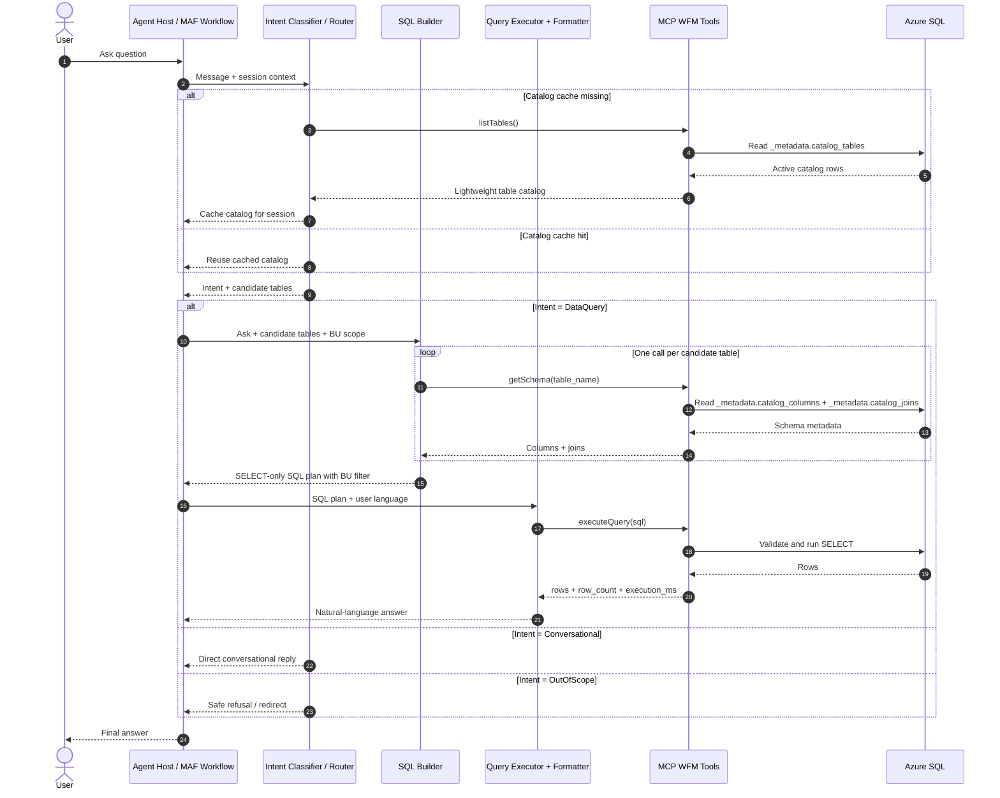

# MAF Workflow Design for WFM Supervisor

**Date:** 2026-05-20T18:13:00Z  
**Author:** Mouse  
**Scope:** Sprint 1 design for the MAF orchestrator workflow, fixed supervisor prompt, and MCP tool contracts.

## 1. Goal

Design a metadata-driven MAF workflow that keeps prompts permanently generic, pushes domain discovery into MCP tools, and stays below a practical per-turn input budget of 10k tokens. The workflow follows architecture decision q14: schema discovery is fully dynamic, so prompts never hardcode table names, columns, joins, or business logic beyond universal safety rules.

## 2. Internal agent responsibilities

### 2.1 Intent Classifier / Router
- Receives the end-user message plus session cache state.
- Classifies the turn as `DataQuery`, `Conversational`, or `OutOfScope`.
- For `DataQuery`, calls `listTables()` once per session when cache is empty.
- Selects a small candidate-table set for the SQL Builder.
- Returns routing metadata: intent, user language hint, candidate tables, and whether the cached catalog was reused.

### 2.2 SQL Builder
- Runs only for `DataQuery` turns.
- Receives the user ask, candidate tables, and BU scope requirements.
- Calls `getSchema(table_name)` for each candidate table.
- Builds one `SELECT` statement only.
- Always includes the mandatory BU filter before handing off to execution.
- Produces a compact structured payload: selected tables, SQL text, assumptions, and failure reason if metadata is insufficient.

### 2.3 Query Executor + Formatter
- Receives the SQL plan from the SQL Builder.
- Calls `executeQuery(sql)`.
- Formats rows into a concise natural-language answer in the user’s language.
- Includes summary counts, highlights, and a short fallback if the query is empty or fails.
- Never invents data; it only speaks from execution results.

## 3. End-to-end sequence

## 4. Token budget estimate per turn

Target: stay under **10k input tokens** on normal turns, versus Calabrio’s current pattern of roughly 50k.

| Component | Estimated input tokens |
|---|---:|
| Fixed supervisor system prompt | 500 |
| User message + recent thread summary | 300 |
| Cached `listTables()` catalog (8 to 20 entries @ ~50 tokens each) | 400-1,000 |
| Router structured output + routing hints | 150 |
| 2 to 4 `getSchema()` responses | 1,200-4,000 |
| SQL Builder instructions + prior plan context | 500 |
| Executor instructions + SQL + result summary | 600-1,500 |
| **Typical total** | **3,650-7,950** |

### Why this stays low
- `listTables()` is lightweight and cached at session scope.
- Only shortlisted tables go to `getSchema()`.
- Prompts do not carry schema encyclopedias or sample SQL libraries.
- The Executor sees result data only after SQL exists, so there is no repeated schema replay.

## 5. Fixed system prompt specification

The WFM Supervisor prompt is fixed forever and stays domain-neutral.

### Mandatory prompt traits
- English only in the system prompt.
- No hardcoded table names, column names, joins, KPI names, or domain-specific logic.
- Always discover available data with `listTables()`.
- Always inspect selected tables with `getSchema()` before writing SQL.
- Generate one `SELECT` query only.
- Enforce BU scoping every time.
- Never answer from memory when the user asks for data.
- Keep explanations short and transparent about uncertainty.

### Fixed prompt structure
1. Mission and role boundaries.
2. Required tool-order policy.
3. SQL safety policy.
4. BU-filter policy.
5. Result-formatting policy.
6. Failure behavior for missing metadata, empty results, and tool errors.

The concrete prompt is stored in `src/agent_host/prompts/wfm-supervisor.yaml` and should be versioned like code. New domains are added in metadata, not in the prompt.

## 6. Session-level caching model

### Cache scope
- Cache lives in the MAF `AgentSession` / workflow context, not in Foundry prompt text.
- Key: `wfm.table_catalog`.
- Value: full result of `listTables()` plus a small digest (`catalog_count`, `catalog_loaded_at`, `catalog_source=tool`).

### Lifecycle
1. First `DataQuery` turn in a session: Router calls `listTables()` and stores the result.
2. Later turns in the same session: Router reuses cached catalog and only refreshes if the session is new, cache is explicitly invalidated, or a metadata mismatch is detected.
3. SQL Builder receives the cached shortlist, not the full catalog if not needed.

### Benefits
- Removes repeated catalog token cost.
- Keeps routing deterministic across turns.
- Preserves q14 because discovery still comes from metadata, just not every turn.

## 7. Error handling policy

### `listTables()` fails
- Router returns a graceful data-access failure message.
- Workflow does not continue to SQL Builder.
- Observability records tool failure and elapsed time.

### `getSchema()` returns empty columns
- SQL Builder treats the table as unusable metadata.
- If other candidate tables remain, continue with them.
- If all candidates are empty, return a safe failure: the system could not confirm enough structure to write reliable SQL.

### `getSchema()` tool error
- SQL Builder drops the failing table and retries with remaining candidates when possible.
- If the last viable table fails, stop the data-query path and return a non-fabricated explanation.

### SQL violates policy before execution
- Executor path is never reached.
- SQL Builder gets a validation failure and must regenerate once with stricter constraints.
- If regeneration still fails, return a safe refusal.

### `executeQuery()` fails
- Executor returns a short apology plus a recoverable data-access explanation.
- No raw SQL or stack trace is shown to the user.
- Telemetry captures guardrail outcome, latency, and sanitized error class.

### `executeQuery()` returns zero rows
- Executor answers clearly that no matching records were found in the allowed scope.
- It may suggest rephrasing the question, but it does not speculate.

## 8. MCP tool contract alignment

| Tool | Used by | Purpose | Notes |
|---|---|---|---|
| `listTables()` | Router | Discover active tables dynamically | Called once per session when cache is cold |
| `getSchema(table_name)` | SQL Builder | Inspect columns and joins | Called only for shortlisted tables |
| `executeQuery(sql)` | Query Executor + Formatter | Validate and run final SQL | Enforces SELECT-only, whitelist, timeout, row cap |

## 9. Observability checkpoints

Recommended OTel attributes for the workflow:
- `agent.name`
- `tool.name`
- `workflow.intent_type`
- `workflow.cache_hit`
- `catalog.table_count`
- `schema.tables_requested`
- `sql.guardrail_outcome`
- `db.execution_ms`
- `db.row_count`
- `user.language`

## 10. Implementation notes for Sprint 1

- `listTables()` should read only active catalog entries from `_metadata.catalog_tables`.
- `getSchema()` should combine column metadata and join metadata from the `_metadata` schema.
- `executeQuery()` must use Managed Identity auth, validate SQL with `sqlglot`, enforce active-table whitelist, and cap returned rows at 1000.
- The fixed supervisor prompt must remain stable even if more business domains are added later.
